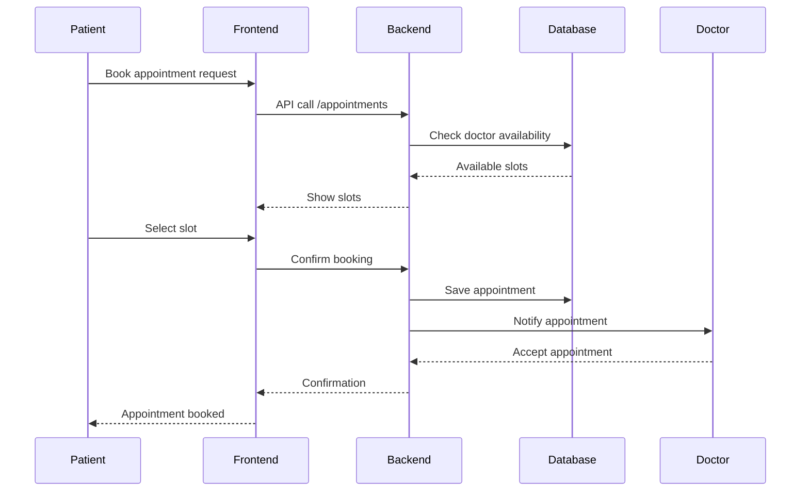

# Sequence Diagram

```mermaid
sequenceDiagram
participant Patient
participant Frontend
participant Backend
participant Database
participant Doctor

Patient->>Frontend: Book appointment request
Frontend->>Backend: API call /appointments
Backend->>Database: Check doctor availability
Database-->>Backend: Available slots
Backend-->>Frontend: Show slots
Patient->>Frontend: Select slot
Frontend->>Backend: Confirm booking
Backend->>Database: Save appointment
Backend->>Doctor: Notify appointment
Doctor-->>Backend: Accept appointment
Backend-->>Frontend: Confirmation
Frontend-->>Patient: Appointment booked
```
