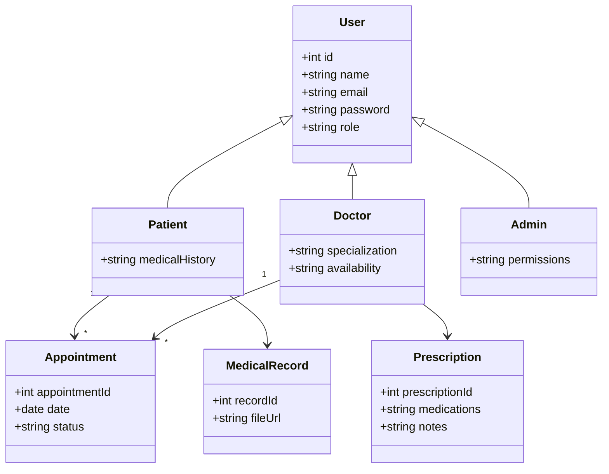

```mermaid
classDiagram

class User {
  +int id
  +string name
  +string email
  +string password
  +string role
}

class Patient {
  +string medicalHistory
}

class Doctor {
  +string specialization
  +string availability
}

class Admin {
  +string permissions
}

class Appointment {
  +int appointmentId
  +date date
  +string status
}

class Prescription {
  +int prescriptionId
  +string medications
  +string notes
}

class MedicalRecord {
  +int recordId
  +string fileUrl
}

User <|-- Patient
User <|-- Doctor
User <|-- Admin

Patient "1" --> "*" Appointment
Doctor "1" --> "*" Appointment

Doctor --> Prescription
Patient --> MedicalRecord
```
