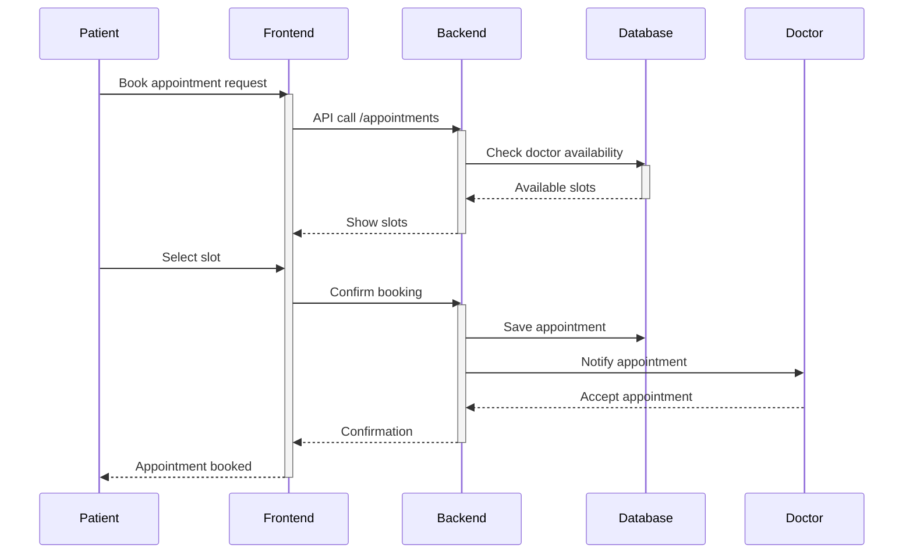

```mermaid
sequenceDiagram

participant Patient
participant Frontend
participant Backend
participant Database
participant Doctor

Patient->>Frontend: Book appointment request
activate Frontend

Frontend->>Backend: API call /appointments
activate Backend

Backend->>Database: Check doctor availability
activate Database
Database-->>Backend: Available slots
deactivate Database

Backend-->>Frontend: Show slots
deactivate Backend

Patient->>Frontend: Select slot
Frontend->>Backend: Confirm booking
activate Backend

Backend->>Database: Save appointment
Backend->>Doctor: Notify appointment
Doctor-->>Backend: Accept appointment

Backend-->>Frontend: Confirmation
deactivate Backend

Frontend-->>Patient: Appointment booked
deactivate Frontend
```
