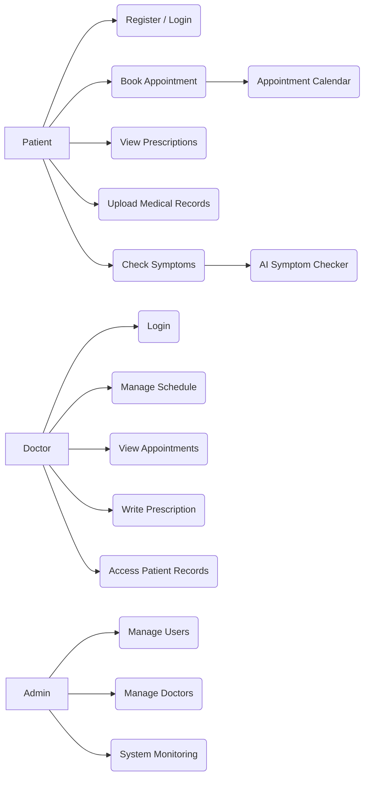

```mermaid
flowchart LR

%% Actors
Patient[Patient]
Doctor[Doctor]
Admin[Admin]

%% Patient Use Cases
RegisterLogin(Register / Login)
BookAppointment(Book Appointment)
ViewPrescriptions(View Prescriptions)
UploadRecords(Upload Medical Records)
CheckSymptoms(Check Symptoms)

%% Doctor Use Cases
DoctorLogin(Login)
ManageSchedule(Manage Schedule)
ViewAppointments(View Appointments)
WritePrescription(Write Prescription)
AccessRecords(Access Patient Records)

%% Admin Use Cases
ManageUsers(Manage Users)
ManageDoctors(Manage Doctors)
SystemMonitoring(System Monitoring)

%% Relationships
Patient --> RegisterLogin
Patient --> BookAppointment
Patient --> ViewPrescriptions
Patient --> UploadRecords
Patient --> CheckSymptoms

Doctor --> DoctorLogin
Doctor --> ManageSchedule
Doctor --> ViewAppointments
Doctor --> WritePrescription
Doctor --> AccessRecords

Admin --> ManageUsers
Admin --> ManageDoctors
Admin --> SystemMonitoring

BookAppointment --> AppointmentCalendar(Appointment Calendar)
CheckSymptoms --> AISymptomChecker(AI Symptom Checker)
```
